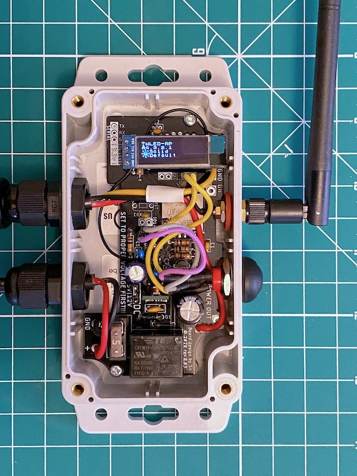
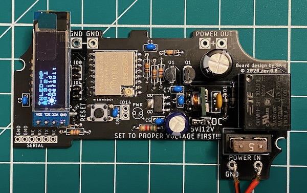

[](https://img.shields.io/github/v/release/srg74/Controller-for-WLED-firmware)
[](https://github.com/srg74/Controller-for-WLED-firmware/master/LICENSE)
[](/resources/FIRMWARE/BIN)
[](https://github.com/Aircoookie/WLED/releases)
[](https://github.com/Aircoookie/WLED-App)
## Wi-Fi LED controller based on ESP-07S module with external antenna for WLED firmware.

```
Controller reference design
```

```
PCB test v0.8
```
## Wi-Fi LED controller with following features
-   Easy to solder components;
-   Relay for reducing delay power consuption;
-   Waterproof enclosure IP67;
-   Level shifter for relaible signal;
-   Power selector (e.g 5VDC or 12VDC);
-   Signal mode select (e.g. GPIO);
-   Serial interface connector 5V logic levels;
-   IR receiver (optional);
-   SSD1306 I2C OLED display 128x32 or 128x64 (optional);
-   Additional button (optional);
-   Dallas temperature sensor for measuring ambient temperature inside of enclosure (optional);
-   [PCB ORDER](https://www.pcbway.com/project/shareproject/Controller_for_WLED_firmware_in_waterproof_enclosure.html) - Easy and fast way to order quality PCB.

## Firmware used
-   [WLED repository](https://github.com/Aircoookie/WLED) - Main WLED repository
-   [Usermod files](https://github.com/Aircoookie/WLED/tree/master/usermods/Enclosure_with_OLED_temp_ESP07) - Folder with required changes to wled06_usermod.ino in WLED repository
## Materials used
-   [Enclosure](https://www.masterelectronics.com/bud-industries/pn1321mb-43418287.html?utm_source=eciaauth&utm_medium=inventoryrefferal&utm_campaign=eciaauth&utm_term=PN-1321-MB) - Bud Industries PN-1321-MB
-   [Connectors](https://www.amazon.com/gp/product/B07DGVBNB7/ref=ppx_yo_dt_b_asin_title_o00_s01?ie=UTF8&psc=1) - SP13-3pin and SP13-2pin
-   [ESP-07S module](https://www.amazon.com/gp/product/B07KRZWZQV/ref=ppx_yo_dt_b_asin_title_o00_s02?ie=UTF8&psc=1) - ESP8266 based ESP-07S module with external antenna
-   [Wi-Fi antenna](https://www.amazon.com/gp/product/B00ZBJNO9O/ref=ppx_yo_dt_b_asin_title_o08_s00?ie=UTF8&psc=1) - 2.4G WiFi Antenna with SMA Cable 3DBI Gain
-   [Push button](https://www.newark.com/philmore/30-12638/switch-operation-momentary-spring/dp/43W7758) - Pushbutton Switch with LED. Manufacturer #30-12638
-   [Custom PCB](https://www.pcbway.com) - Custom PCB ordered from PCBway. 10pcs for $5!
-   [BOM for PCBs](https://github.com/srg74/Controller-for-WLED-firmware/blob/master/resources/) - Here is BOM for controller. PLEASE REFFER TO YOUR BUILD!
#### Board creation is inspired by https://github.com/Aircoookie/WLED/wiki
